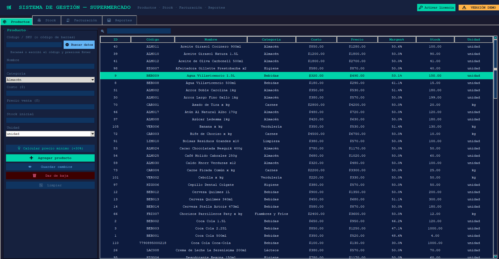
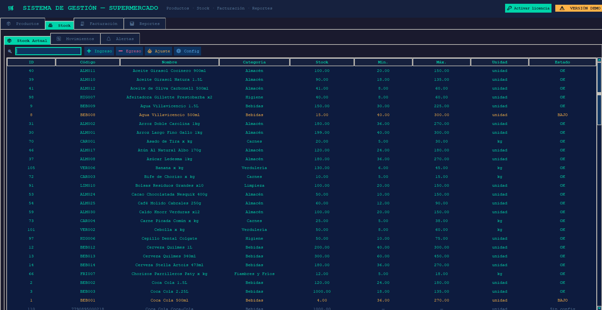
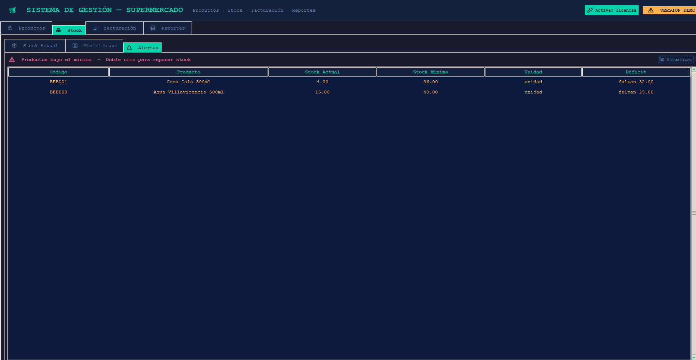
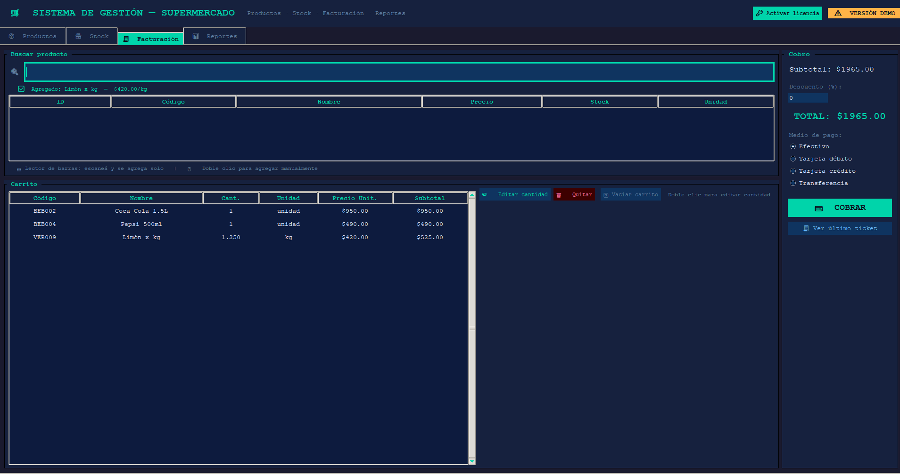

# GestionSupermercado
Sistema de Software para gestión de supermeracdo (chico, mediano, grande). Programa con soporte y en constante actualización según las necesidades de cada negocio.

# 🛒 GestionSupermercado

**Sistema de gestión integral para supermercados — Windows**

Software de escritorio diseñado para simplificar la operación diaria de supermercados medianos y grandes. Funciona completamente sin conexión a internet y no requiere instalación. Diseño totalmente adaptable según las necesidades/gusto del cliente.

Solo descargá el .exe y ejecutalo. No necesitás instalar Python ni ningún otro programa.

-----------------------

** Funcionalidades:

###  Gestión de Productos
- Alta, modificación y baja de productos
- Código de barras compatible con lectores físicos
- Consulta automática de nombre y categoría desde base de datos mundial (Open Food Facts)
- Control de margen mínimo de ganancia del 30% con alerta en tiempo real
- Historial de cambios de precio

###  Control de Stock
- Ingreso, egreso y ajuste de inventario
- Alertas automáticas de stock mínimo con acceso directo a reposición
- Historial completo de movimientos con proveedor y número de remito
- Colores indicadores: 🔴 sin stock · 🟡 stock bajo · 🟢 stock normal

###  Facturación / Punto de Venta
- Compatible con lector de código de barras — flujo completo sin mouse
- Búsqueda inteligente sin tildes ni distinción de mayúsculas
- Carrito de compras con edición de cantidades
- Soporte para productos por peso (ej: 0.500 kg)
- Descuentos por porcentaje
- Medios de pago: efectivo, débito, crédito, transferencia
- Emisión de ticket por venta

###  Reportes
- Ventas por día con detalle completo al hacer doble clic
- Ranking de productos más vendidos
- Resumen por período: total recaudado, ticket promedio, descuentos

---

** Requisitos:

| Sistema operativo | Windows 10 / 11 |
| Instalación requerida | Ninguna |
| Conexión a internet | No requerida (opcional para consulta de códigos de barras) |
| Espacio en disco | ~15 MB |

## 🚀 Cómo usar

1. Descargá `GestionSupermercado.exe`
2. Colocalo en una carpeta de tu elección
3. Hacé doble clic para ejecutar
4. La base de datos se crea automáticamente en la misma carpeta

> La versión de descarga es una **demo gratuita** con las siguientes limitaciones:
> - Máximo 20 productos
> - Máximo 10 ventas por día
> Para adquirir la licencia completa, contactate por email a agustinnapo@gmail.com

---

## ⌨️ Navegación por teclado

El sistema está diseñado para operarse completamente sin mouse, ideal para cajeros:

| Tecla | Acción |
|---|---|
| `F1` | Ir a Productos |
| `F2` | Ir a Stock |
| `F3` | Ir a Facturación |
| `F4` | Ir a Reportes |
| `Ctrl + →` / `Ctrl + ←` | Cambiar pestaña |
| `↑` `↓` | Navegar tablas |
| `Enter` | Seleccionar / Confirmar |
| `F2` en carrito | Editar cantidad |
| `Delete` en carrito | Quitar producto |
| `Escape` | Volver / Cerrar ventana |

---

##  Capturas de pantalla

---

##  Licencia del software

Este software es de uso comercial. La versión demo es gratuita con limitaciones.
Para adquirir una licencia completa (permanente o anual), contactate:

📧 **agustinnapo@gmail.com**

---

##  Desarrollado por

**Agustín** — Desarrollador independiente  
📧 agustinnapo@gmail.com

---
                
*© 2025 GestionSupermercado — Todos los derechos reservados*
